# Exploring the Benefits of GraphQL: A Practical Guide

GraphQL is a query language that aims to streamline and facilitate the query and manipulation of data from an API so that it can be consumed in a more practical way, it also brings a clean code in its structure since the API structure in GraphQL is built in schemas, better organizing its creation and facilitating maintenance.

GraphQL is available for use in the following programming languages:

* JavaScript
* Go
* PHP
* Java / Kotlin
* C# / .NET
* Python
* Rust
* Ruby
* Elixir
* Swift / Objective-C
* Scala
* Flutter
* Clojure
* Haskell
* C / C++
* Elm
* OCaml / Reason
* Erlang
* R
* Groovy
* Julia
* Perl

I will use the javascript language to exemplify this repository.
# Why should I use GraphQL?

Each API structure has its functionality and its usefulness, however GraphQL stands out in some points that are essential in a complex application, see below its main points.

## 1. Better consultation of desired data

One of the main features of GraphQL is its convenience to consume data from the API, and this data is extracted in the way you want, see the example below:

Example: You are creating a screen for a music application, this screen requires information from the logged in user and information from your playlist, both are different entities in your database, an API structured with routes would be necessary to search for the corresponding user and the search route of playlists for that user, or structure a route that does both of these things, but in GraphQL if you have already structured the user query and the playlist query it will be possible to perform both searches in a single request.

Using postman for demo I structured the requests for a conventional API and an API in GraphQL.

Please note the requests below:

**API Convencional request**

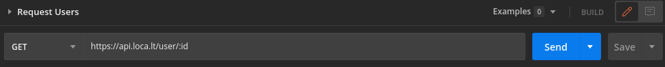
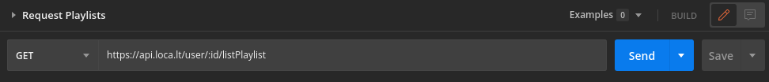

**GraphQL request**

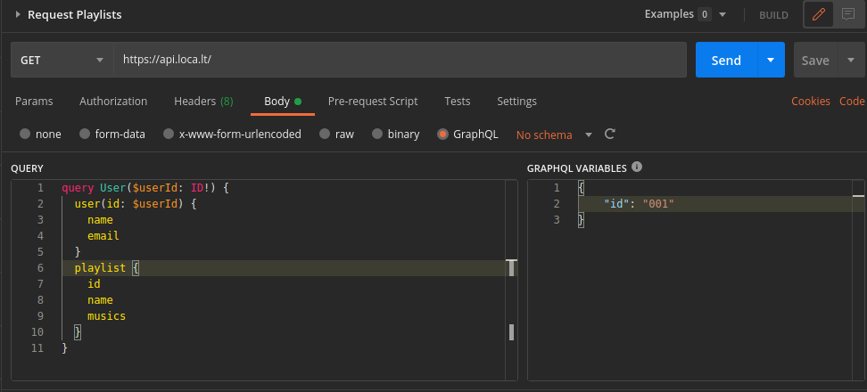

As you can see it is possible to search as two entities in a single request and it is still possible to request only the requested data.

## 2. Graphic assimilation

The GraphQL presupposes the graphical view of the requested information, but after all, what does this mean!?

The creators of GraphQL believe that the best practice for consuming an API is the mental graphical assimilation of data, that is, to consume the data from an API it is necessary to intuitively search for information and as GraphQL's schemas search for exactly what you ask, the mental association of consumption is intuitive and practical.

To demonstrate this I will again use the request image in GraphQL for Music API.


In the fields of the request, it is possible to see that it is looking for name and email for the user and for the playlist id, name and songs, but if the entity referring to each one has more information, it is possible to search only by entering the name of what you want in the fields of the search, in a practical and intuitive way.
## 3. Clean code organization

Later, I'll be explaining how to structure the API in GraphQL and thus facilitating your understanding of this highlight, but it is important to say that because it is completely organized in schemas, the API has a better assimilation both for creating and maintaining a code.

Look at a mutation schema, which I'll explain later:

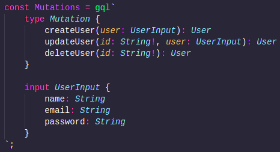

Organized and intuitive, everything you need to make the process of creating and maintaining a code easy to understand.

# API creation

In order to learn how to structure an API in GraphQL, we will start a project, its objective will be to create, update and delete a user.

To create the API in GraphQL you will need a server for its operation, but as this is a unique way to create an API, you need a server that supports its operation, some popular examples of servers in GraphQL are:

* Apollo-server
* Graphql-yoga
* Express-graphql

Each one has its particularities, but in general, everyone has the function of creating a server for GraphQL, as my goal in this repository is not to detail types of GraphQL servers, but to teach how GraphQL works. I will not go into depth on the characteristics of each server, however I will use apollo-server to create the API.
## Start of the project and installation of dependencies

Initially create a folder for the project or project, in my case I had already made a local repository previously

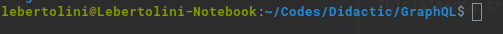

Then in that same repository start an application project with command "npm init -y" in your terminal.

Now your repository is ready to receive the necessary dependencies in its creation, I'm using yarn on my computer and with it I ran the command "yarn add graphql apollo-server mongoose nodemon dotenv" I'll explain the use of each dependencies:

* graphql (necessary): Used to create the GraphQL server.
* apollo-server (necessary): Used to create the server.
* mongoose (necessary): Nin this case I'm using MongoDb as a database, for this reason it is necessary to use its mongoose library for the API to work, however you can choose to use another database.
* nodemon (optional): Biblioteca utilizada para que o servidor se reinicie a cada atualização, não sendo necessário desligar e ligar o servidor a cada alteração.
* dotenv (optional): dotenv is important to hide sensitive information and that it is not exposed in a public API.


## Server creation

To create the server it will be necessary to create a file for it, but for a better organization we will create a folder called src inside the repository and inside it we will create a file called index.js.

You must have something close to that.

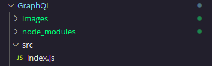

With the exception of the images folder I'm using to store files from the online repository.

In the index.js file, import mongoose, ApolloServer, dotenv, typeDefs and resolvers as shown in the image below:

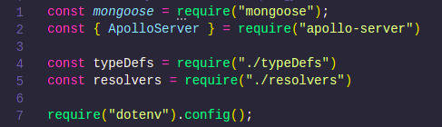

Let's leave the typeDefs and resolvers folders predefined, essential settings for GraphQL's operation are in these files that the schemas and business rules are contained, but I'll address them better later.

Dotenv, as I mentioned before, is a file to store sensitive information that will not be sent to the virtual repository. i will make a connection to the database, for that I'll create a .env file that will contain the URI.

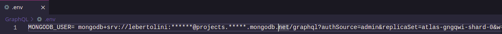

Connect to MongoDb through mongoose.connect() bringing its respective connection parameters and URI.

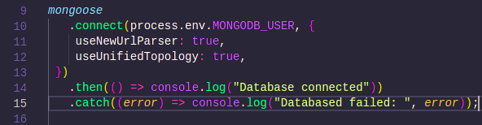

Note: To bring the sensitive information from the .env it is necessary to use the command process.env.VariableName

Also create the apollo server using the "new ApolloServer" method stored in a constant, in this you will use the call of typeDef and Resolvers as the object of the first parameter, these have not yet been created and the purpose of this is just to leave the previous preparation, later I will cover about each one.

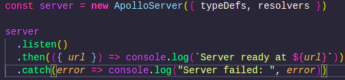

For this server to be started, use the .listen, I also chose to show on the console the case of the connection being successful and if it goes wrong through then and catch, as shown in the image.

In the end you should keep your index.js file like this:

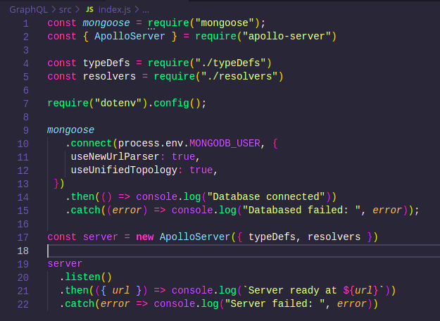

## TypeDefs e Resolvers

The typeDefs and resolvers are the structures responsible for the operation of the requests, being responsible for the schemas the typeDef and the resolvers responsible for creating the business rules used in these schema components, but I will describe each one in detail below.

### TypeDefs

Typedefs are responsible for creating the format of the **queries and mutations** of our API, that is, they will create the structure model that will be consumed by the resolvers and consequently the format accepted in a request.

#### **But if typedefs create the request scope, what is this categorization of "queries" and "mutations" ?!**

Queries and mutations are GraphQL categorizations for searching and modifying an entity respectively, that is, typeDefs create the format of a query that is used to search for information from an entity or create the format of a mutation that is used to create, modify or delete an entity.

From the queries and mutation formats created by typeDefs, the resolvers create business rules with or without database manipulations to search or change what was previously created in the scope.

In practice, typeDefs create the format of queries for searches and mutations for creations and modifications of an entity also delimiting the requests to the server in this predefined format and the resolvers will dictate what will happen in those queries and mutations.

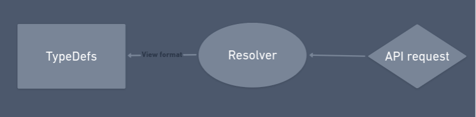

Without further ado, let's create the TypeDef of our API.

First, inside the src folder create the following files: index.js, mutations.js, query.js and types.js

Each of these files used ​​to create a kind of functionality of our API.

#### **Types**

Types are schemas that dictate what can enter and leave requests, they are responsible for the format of the entities, in the case of our API we will create a type for the user, bringing the information it must contain, don't confuse types with typeDefs, the type is a file that delimits the properties of entities, typeDefs delimit queries and resolvers as I said earlier, types are contained in typeDefs.

In type.js import the { gql } object into a constant that comes from require apollo server

```js
const { gql } = require('apollo-server')
```

Then create a constant called types on it you will use the gql object by opening grave accent then, within this scope you will declare a type User containing user information as in the example below:

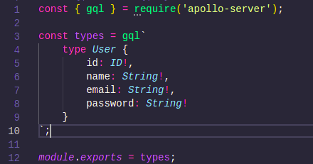

Note: In your code editor, the colors may not be improving the visualization in GraphQL, this happens in mine, because I'm using the GraphQL extension for my code editor, which is VScode.

As you can see at the end I created a module.export to export my types.

Something important to say about types is that this file is used to create types that will be used both in queries to find a user and in resolvers to create or modify that user, for this reason the existence of this file, to reuse a type.

#### **Mutations**

Mutations are responsible for creating, modifying and deleting some entity in GraphQL, in general we will define their format in typeDefs, then we will consume the format in resolvers later.

To define our mutations, access the mutations.js file and import gql from the apollo server, similarly to types you will define a constant called Mutations opening a back accent and writing a type called mutations, inside this type you will define your mutations , watch:


As you can see I created the type mutation as I instructed and inside it I defined 3 mutations with different names to createUser, updateUser and deleteUser.

Every mutation has the same format as it is: name, input and return.

The name is a name that you will give to the mutation representing its functionality, as if you were defining a function, opening parentheses we define what the inputs for your mutation will be, that is, what will be the input allowed in your request , finally we use a colon in front of it, we will define what will be the output of mutation, which is a previously defined type.

In the case of our mutations we have the user creation one, this is interesting to comment because in its input inside parentheses we put a user referencing a userInput, as you can see below the mutations I declared an input containing the information that the user must enter in your request, this declaration model ie **input** is similar to **type** with the difference that the input is used exclusively in the input parameter of a mutation or query.

We also have an updateUser that has two entries, one being the user id and the other the information that will be updated, with the user returning.

Lastly we have the deleteUser, as you can see the input of this mutation is defined in the parentheses scope itself and it is not necessary to create a separate input scope, this is possible for any mutation.

Note: The use of the exclamation point is to define the requirement, in the examples used in print we define the id's being necessary for the use of mutations since to change or delete a user it will be necessary to know its ID, if the user makes the request without this information, the request will be blocked with an error warning.

How the file should look:

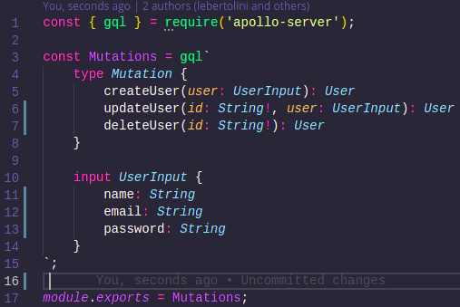

We export the file as well as types.

#### **Queries**

Querie has a format very similar to mutations, with the difference that its functionality is just the query of entities.

To define the queries we must import apollo-server's gql as we did in mutations and types, define a constant and open the scope as we did before.

Observe o arquivo:

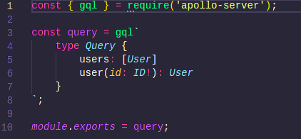

As you can see the model is very similar, defining the name, the input if necessary, and the return.

We have two queries, the first one aims to list all users, in this case we won't need an input to trigger it, so there is no opening parentheses only the name, then we define its return which are users. Note that I used square brackets to put the return, in GraphQL when you put a type inside a square bracket it understands that you are formatting it to be an array, in this case as the objective of the query is to list all users, we take the type user and put it it in square brackets, so the return can be an array of users.

The second query has a format very similar to what we have already seen, defining its name, in the input accepting an id, this not being defined in a scope, but together with the query definition itself and then returning a user.

#### **Index**

With our types, mutations and queries defined we should allow them to be imported and this is the function of the index, to centralize them all so that the server can consume our typeDef as defined in the creation of the server.

Inside index create 4 constants: types, mutations, query and typeDefs. Types will import the type part, mutations the mutation folder and query the query folder and by fin typeDefs will be an array with these three constants that will be exported through module.export.

Note how it will look:

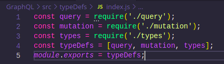

With that we already have one of the files that we defined when creating the server, the typeDefs responsible for the format of our queries and mutations.

### MongoDb Schema

Before the creation of our resolver that will be responsible for our business rules, we need to create the schema of our database so that it has the user's archiving that will consequently allow us to create, update or delete this same in the resolver.

For that, create a folder called models inside src, in it you will create a file called user.js.

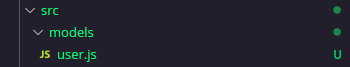

Inside this file you will import the mongoose and declare a constant called UserSchema, this constant will contain a mongoose.Schema containing the characteristics of the user which are name, password and email. Then you will use a module.export exporting a mongoose.model from this schema as the name "User".

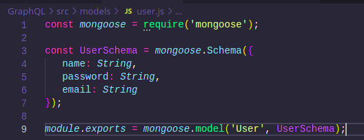
### Resolvers

With our formats structured through typeDefs and our database schema created, let's code our resolvers, which will consume both and create a business rule for each resolver.

Inside src create a folder called resolvers, inside it a file called index.js and a file called userResolver.js.

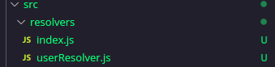

In sequence, accessing the userResolver.js file, we will develop our queries and mutations, to do so, import the schema of the User model in a constant called User.

After that create a constant called userResolver, inside this constant you will open keys and inside these keys put two objects, one named Query and the other Mutation

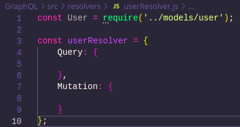

#### **Query**

Inside the query we will create two queries, one with the name of users and the other with the name of user, mirroring the typeDefs created for these queries. It is important to mention that the resolvers are mirrored in the typeDefs, if you create the resolvers with different characteristics when starting the server, GraphQL will warn you that the format is wrong, or it is possible that the server will start but when you try to make a request it will not work as expected.

Note: From personal experience I say that one of the easiest places for you to get confused in the beginning of practice with GraphQL is mirroring this typeDef format with resolver, so pay attention to whether the information created in the resolver matches the typeDefs.

The query declaration is very similar to the query's typeDef, after you declare the name as in typeDef you will open brackets like there to insert the input format, with the difference that you will then put an arrow function which is where it will go stay your business rule, note:

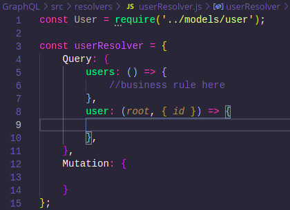

As you can see in the Users Query I put the "root" in the parameters, this parameter is used as a kind of websocket, that is, it is a way of passing information between the requested query and a webserver, but as we are not going to use it in this project it is unusable, but note the second parameter, which are the query arguments, in this case we are getting the id that will come to the request of this query so that we can search the user specifically, which is the purpose of this query.

So that we can search the database, let's use the User.find() method for query users, this mongoose method used in this way returns all users. And finally, let's use the User.findById() method to find the user in the user query.

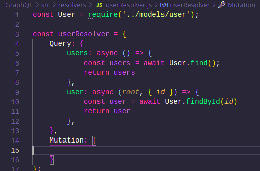

As you can see I used the query asynchronously because for the request to the database to be complete it is necessary to wait for the promise to be made.

Note: The return for the query must be the same as defined in the return of the typeDef, otherwise it will bug the request.

#### **Mutations**

In mutations we will create the three mutations that define the format in typeDefs, remembering that the names and format must be identical to the typeDefs.

Create three mutations with the respective names given in the typeDefs which are: createUser, updateUser and deleteUser. Putting in your inputs what was predefined.

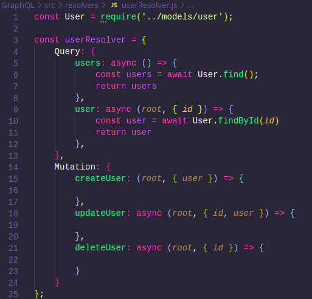

Now we must include the methods according to the database, to create the user I will use mongoose's new User method, to update the user the findByIdAndUpdate method and to delete the User.findByIdAndRemove method.

After that I will create the module export for the userResolver and the file will look like this.

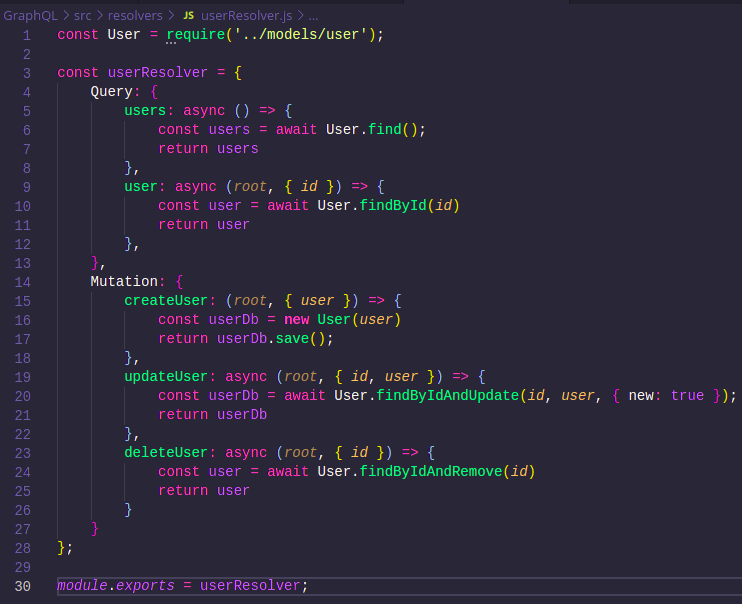

#### Index

With the created userResolver, let's import it into the index to centralize the resolvers if you want to create a new resolver later.

In the index file of the resolvers folder, create a constant by importing the userResolver and a constant called resolvers containing an array, this one with the userResolver, then export the constant.

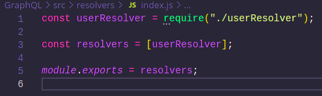


# Test the API

To test the API, apollo server makes apollo studio available, accessing the URL of the local server.

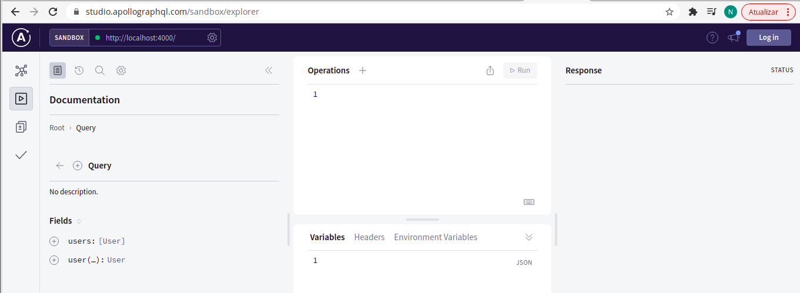


